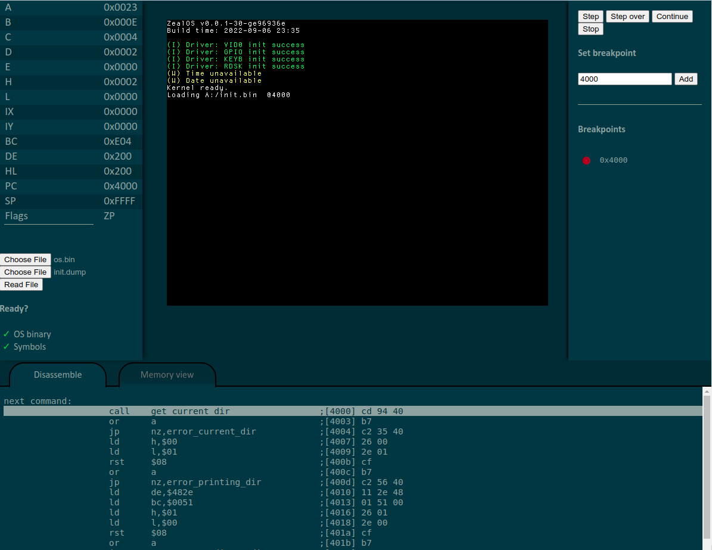

<!--
    /**
    * SPDX-FileCopyrightText: 2022 Zeal 8-bit Computer <contact@zeal8bit.com>
    *
    * SPDX-License-Identifier: Apache-2.0
    */
    Version: 0.0.1,
    Author: Zeal 8-bit Computer
    Translator: JasonMo, ZT-Pepite
    Last modified: 2023/07/21 8:16,
    Last commit: "Project: Reconstitution, delete useless files",
-->

<h1 align="center">Zeal 8-bit Computer emulator</h1>
<p align=center>
    
    <a href="https://opensource.org/licenses/Apache-2.0">
        
    </a>
    <a href="https://github.com/ZT-Pepite/Zeal-WebEmulator/edit/patch-2/docs/README_zh_hans.md">
  
</a>

</p>

<p align="center">
    <a href="../README.md">English</a> | 简体中文
</p>


**👏中文介绍———Zeal 8位计算机软件模拟器创建和使用指南👏**
- **[点击此处访问在线模拟器](https://zeal8bit.github.io/Zeal-WebEmulator/)**
- [Zeal 8位计算机](https://zeal8bit.com/)是一台自制的8位计算机，基于Z80 CPU。
- Zeal 8位计算机的[B站频道](https://space.bilibili.com/1042658991)
- [购买 Zeal 8位计算机](https://www.tindie.com/products/zeal8bit/zeal-8-bit-computer-developer-edition-z80-based/)
- 中国购买请联系`contact@zeal8bit.com`
  
## ✅模拟器的目的是什么？

用该模拟器可以实现与真实机器完全相同的模拟，以便可以直接在主机上执行并调试为Zeal 8位计算机编写的程序，而无需手动写入任何EEPROM或NOR闪存。这有助于简化开发和测试流程。

## ⭐️为什么选择创建一个网页模拟器？（使用HTML/CSS/JavaScript）

主要目标集成模拟器到 [zeal8bit.com](https://zeal8bit.com)网站中。因此，选择HTML/CSS和Javascript在这方面优势明显。

此外，任何人都可以在任意平台（Linux / Windows / Mac OS X）上为Zeal 8位计算机测试或编写程序，而无需安装工具链。

模拟器已在Opera，Google Chrome和Microsoft Edge等浏览器上进行了测试。

## 🧐性能如何？

哪怕Zeal8位计算机上的CPU硬件用的是 10MHz 频率的Z80，模拟器运行速率还是会比实际硬件慢。这是由于Javascript本身和Web浏览器本身的消耗。不过别忘了，模拟器的主要功能是调试程序，从这个角度来看还是相当不错的。

此外，模拟器在时间方面并不是完全准确的，更多详细信息可以在“功能”部分找到。

用 **C语言** （w/ SDL） 编写原生仿真器将会更快，这在计时方面会更准确。但是，这需要一些时间投入。如果您对此类项目感兴趣，请随时与我联系或提供贡献。

## 🎯如何使用模拟器？
有几种使用模拟器的方法：
* 使用在线模拟器：[在线模拟器](https://zeal8bit.github.io/Zeal-WebEmulator/)。您无需安装任何其他东西就可以使用模拟器。
* 克隆这个存储库，并使用网络浏览器打开 `index.html`（首选 Google Chrome 或 Opera）。
* 使用 Electron 从此存储库创建一个应用程序。更多详细信息可以在下面找到。

### 如何使用Electron？

#### 安装依赖项

首先，您需要克隆此当前存储库，然后使用包管理器安装程序依赖项。如果您使用的是 `yarn`，请使用以下命令：

```bash
cd /path/to/Zeal-WebEmulator
yarn install
```

如果您使用的是 `npm`，则命令如下：

```bash
cd /path/to/Zeal-WebEmulator
npm install
```

如果您遇到了任何问题，您可以在[electron forge官方网站](https://www.electronforge.io/import-existing-project)上找到更多信息。

#### 运行

在依赖项安装完成之后，你可以使用

```bash
yarn start
```

或

```bash
npm start
```

命令来启动你的模拟器。

#### 发布

目前支持的架构：

`win` `win64` `linux`

npm：

```bash
npm run dist-<arch>
```

yarn：

```bash
yarn dist-<arch>
```

例如，如果要为 Windows-x64 生成完整程序及安装包，请运行以下命令：

```bash
npm run dist-win64
```

或：

```bash
yarn dist-win64
```

## ✅目前支持的功能

目前，该模拟器实现了Zeal 8位计算机的以下功能：

* Z80 CPU（[感谢*Molly Howell*](https://github.com/DrGoldfire/Z80.js)）
* Z80 PIO：支持所有模式，包括端口 A 和 B。实现了独立于连接的设备。
* 22 位 MMU
* 256KB 只读存储器
* 512KB 内存视频芯片：拥有640x480带颜色文本模式及640x480带颜色图形模式
* 带中断的PS/2 键盘
* UART：可以发送和接收字节。也可以发送文件。波特率可以从 GUI 更改
* I2C：总线仿真，支持读/写/读写操作
* I2C RTC：始终返回当前日期
* I2C EEPROM：仿真24C512，因此硬编码为64KB EEPROM。内容可以通过 GUI 加载。

模拟器本身实现的功能：

* 调试器：断点、单步执行、单步执行指令、继续直到下一个断点
* 加载二进制文件，直接加载到ROM
* 加载从“z88dk-dis”生成的转储文件，在进行分步调试的同时查看汇编代码
* 使用**十六进制**PC地址或符号（来自转储文件）设置断点
* 在进行分步调试时查看内存内容
* UART 视图的专用选项卡

## ❗️待办

模拟器端要执行的其余任务是：

* I2C RTC 设置日期。目前，它始终返回当前浏览器日期，因此写入它不会产生任何改变。
* 声音支持¹
* SD 卡仿真¹
* 视频芯片：320x240文本模式，320x240图形模式¹，精灵图¹，4位调色板¹等...

¹：优先级**较低**的功能，因为它们尚未在实际硬件上实现。

* 调试器按钮的更好界面，带有一些快捷方式
* 解析断点输入的更好方法。一个已知的错误是，提供以十六进制字母开头的标签将被解释为 PC 值而不是标签。例如，输入 *date_routine* 作为要中断的标签将导致在地址 0xda 处添加断点，而不是标签 *date_routine* 的地址（因为 *date* 以十六进制字母 *da* 开头）

## 👬为项目做出贡献

欢迎大家对该项目积极贡献！任何人都可以为这个项目做出贡献。

您可以按照您的意愿修复任何错误，也可以实现待办列表中的功能，或您认为有用或重要的新功能。

贡献流程：

* 分叉项目
* 创建您的功能分支（*可选*）
* 提交您的更改。请制作清晰简洁的提交消息 （*）
* 推送到分支
* 打开拉取请求

(*) 下面是一个正确的提交示例：
    译者注：提交，议题及拉取请求消息请用英文

```example
Module: add/fix/remove a from b

Explanation on what/how/why
```

例如：

```example
Video chip: implement 320x240 text-mode

It is now possible to switch to 320x240 text-mode and display text.
```

## 📝许可证

`Z80.js` 在MIT licence下取得许可 (源自Molly Howell的存储库：[Z80.js](https://github.com/DrGoldfire/Z80.js))

所有其他文件都在 Apache 2.0 许可证下分发。有关详细信息，请参阅“许可证”文件。

您可以自由地将其用于个人和商业用途，但不得删除每个文件中存在的样板。

## 📪联系方式

如有任何建议或要求，您可以通过 `contact@zeal8bit.com`与我联系

对于功能请求，还可以打开议题或拉取请求。
